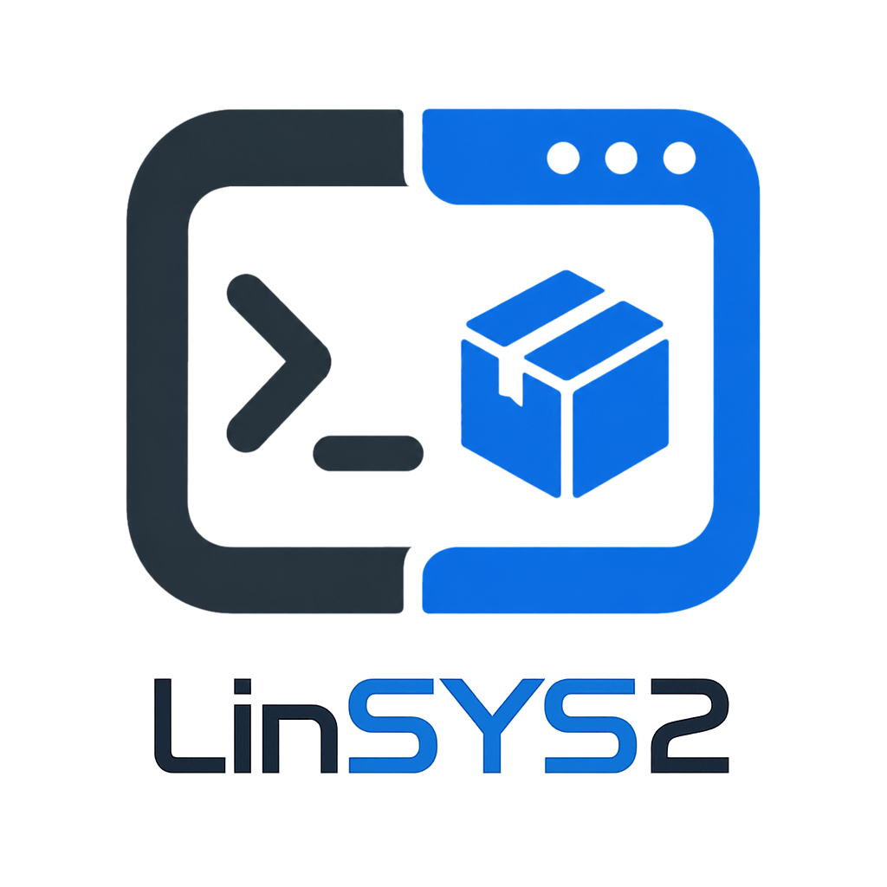

# LinSYS2

<div align="center">
  
</div>

[](COPYING)
[](https://deepwiki.com/wszqkzqk/LinSYS2)

**Build, debug, and run Windows programs on Linux with the full MSYS2 ecosystem.**

**No VM. No dual-boot. No containers.**

LinSYS2 installs the [MSYS2](https://www.msys2.org/) Windows package ecosystem on Linux — the **actual Windows toolchain and libraries** from MSYS2 repositories, running through [Wine](https://www.winehq.org/). You are building Windows binaries with the same toolchain that runs on Windows. Not a Linux port that behaves differently.

---

## Quick Start

```bash
# Install a Windows compiler
linsys2-pacman -Sy mingw-w64-ucrt-x86_64-gcc

# Run it on Linux. No VM needed.
linsys2 run -- gcc -v
```

Two commands. You just installed and ran a Windows program without leaving Linux!

---

## Why LinSYS2

Traditional cross-compilation installs a Linux port of the MinGW toolchain. You compile with it, but the build process differs from Windows — and you cannot run or debug the result.

LinSYS2 installs the **actual Windows toolchain** from MSYS2. Same GCC. Same GDB. Same build process. You compile, debug, and run exactly as you would on Windows — from your Linux shell.

| | Traditional Cross-Compile | LinSYS2 |
|---|---|---|
| Build toolchain | Linux port of MinGW | Windows Compiler from MSYS2 |
| Build behavior | May differ from Windows | Identical to Windows |
| Run binaries | No | Yes (through Wine) |
| Debug with Windows GDB | No | Yes |
| Libraries | Linux-distro packaged | Identical to Windows |
| Package manager | Distro or manual | MSYS2 pacman |

---

## Features

- **Same toolchain as Windows** — install the actual Windows GCC/LLVM, GDB/LLDB, and CMake/Meson, etc. Not a Linux cross-compiler port. Identical libraries. Identical behavior. Identical binaries.
- **Full dev lifecycle on Linux** — install packages, compile, debug, run tests, and ship Windows binaries, all from your Linux shell
- **No VM, no containers** — runs through Wine at near-native speed
- **User-level isolation** — everything lives in `~/.local/share/linsys2/`. No root, no system conflicts
- **Multi-target** — ucrt64, clang64, and clangarm64 from a single machine

---

## How It Works

LinSYS2 has two commands:

| Command | Purpose |
|---------|---------|
| `linsys2-pacman` | Package management — install, remove, and upgrade Windows packages from MSYS2 repos |
| `linsys2` | Wine integration — run programs, manage PATH registration, inspect environments |

Under the hood, `linsys2-pacman` runs the patched [MSYS2 fork of pacman](https://github.com/msys2/msys2-pacman) built for Linux, pointed at MSYS2's official repositories. Packages install to `~/.local/share/linsys2/`.

`linsys2 run` uses an isolated Wine prefix and injects the environment via `WINEPATH` — no setup, no registry changes, no pollution of your existing `~/.wine`. If you prefer, `linsys2 register` adds the environment to your existing Wine installation instead.

---

## Installation

### Arch Linux

**From AUR** (recommended):

```bash
# Using yay
yay -S linsys2

# Or using paru
paru -S linsys2
```

**Build manually**:

```bash
git clone --recursive https://github.com/wszqkzqk/LinSYS2.git
cd LinSYS2
makepkg -si
```

### Other distributions

Other distributions should install the equivalent packages under their own package names.

* **Build dependencies:** `meson ninja-build gcc make git patch pkg-config libarchive libssl libgpgme libcurl`
* **Runtime dependencies:** `bash coreutils gawk grep gettext which curl gnupg openssl libarchive bzip2 xz zstd wine python`

On Debian/Ubuntu:

```bash
sudo apt install meson ninja-build gcc make git patch pkg-config \
    libarchive-dev libssl-dev libgpgme-dev libcurl4-openssl-dev \
    gawk gettext which gnupg wine python3
```

On Fedora:

```bash
sudo dnf install meson ninja-build gcc make git patch pkg-config \
    libarchive-devel openssl-devel gpgme-devel libcurl-devel \
    gawk gettext which gnupg wine python3
```

Build and install:

```bash
git clone --recursive https://github.com/wszqkzqk/LinSYS2.git
cd LinSYS2
make && sudo make PREFIX=/usr install
```

---

## Usage

### Package Management (`linsys2-pacman`)

```bash
# Sync databases and upgrade
linsys2-pacman -Syu

# Install packages
linsys2-pacman -Sy mingw-w64-ucrt-x86_64-gcc

# Search
linsys2-pacman -Ss zlib

# Remove
linsys2-pacman -R mingw-w64-ucrt-x86_64-cmake

# List installed packages
linsys2-pacman -Q

# Target a different environment
linsys2-pacman --env clang64 -S mingw-w64-clang-x86_64-llvm
```

### Build, Debug, Run (`linsys2`)

#### Isolated WINEPREFIX (Recommended)

`linsys2 run` works out of the box. It uses an isolated Wine prefix under `~/.local/share/linsys2/` and injects the environment's bin directory via `WINEPATH` — no prior setup, no registry changes, no pollution of your existing Wine installation.

```bash
# Compile a Windows executable with Windows GCC
linsys2 run -- gcc -o app.exe app.c

# Debug it with Windows GDB
linsys2 run -- gdb app.exe

# Build a CMake project the Windows way
linsys2 run -- cmake -B build -S .
linsys2 run -- cmake --build build

# Run any installed Windows program
linsys2 run -- python --version
# Run your own Windows executable
linsys2 run -- ./example.exe --your-flags

# Or drop into a shell where all Windows tools are in PATH
linsys2 shell
```

> **Always use `--`** to separate `linsys2` options from the program's own flags.

#### Existing Wine Integration

Your **existing** Wine environment (`~/.wine` or `$WINEPREFIX`) is also supported:

```bash
linsys2 register    # add bin directory to your Wine PATH registry
linsys2 env         # inspect registration
linsys2 unregister  # remove from Wine PATH
```

---

## Environments

| Name | Compiler | Default On |
|------|----------|-----------|
| `ucrt64` | GCC and Clang | x86_64 |
| `clang64` | Clang Only | — |
| `clangarm64` | Clang Only | ARM64 |

The default is auto-detected from your CPU. Override with `--env`.

---

## License

* [GPL v2 or later](COPYING).
* The pacman binaries are built from [MSYS2 pacman](https://github.com/msys2/msys2-pacman) sources with additional patches, also GPL v2+.

---

## Acknowledgments

- [MSYS2](https://www.msys2.org/) — the pacman fork and package ecosystem
- [Arch Linux](https://archlinux.org/) — original pacman
- [Wine](https://www.winehq.org/) — the Windows compatibility layer
